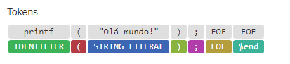
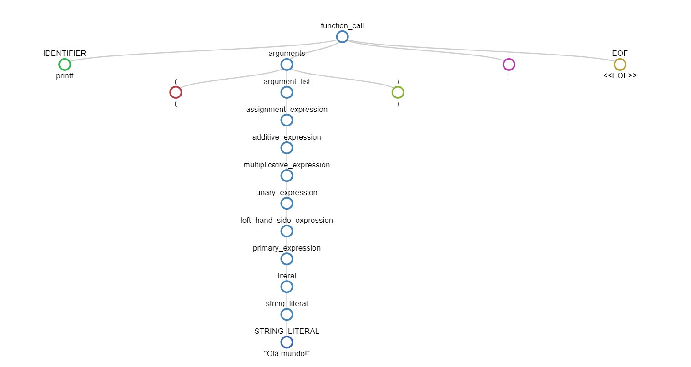
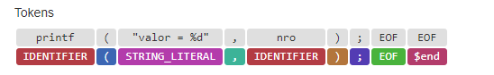
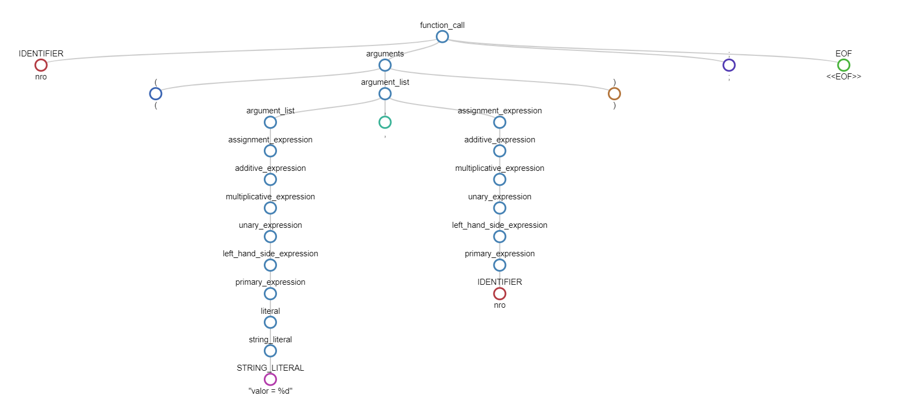
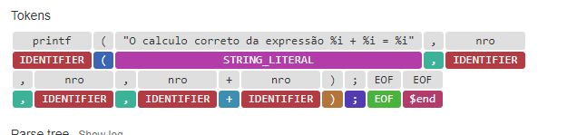
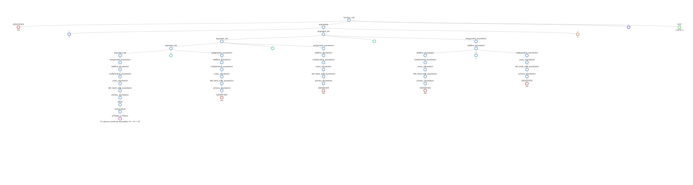
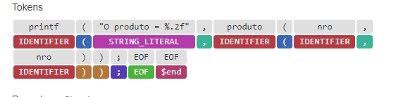
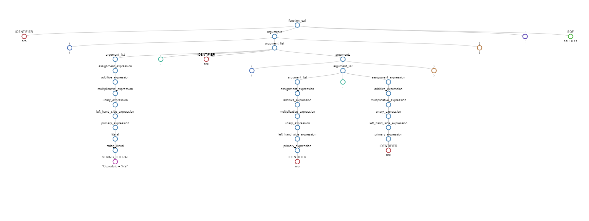

Trabalho grau A

Marco Vinicius Soares Dall'Alba
Matheus Milanezi

Gramatica criada com a ferramenta JISON (https://gerhobbelt.github.io/jison/docs/)

Para debugar de maneira mais legivel utilizamos a ferramenta Jison debugger (https://nolanlawson.github.io/jison-debugger/)

1 – Desenvolva uma Gramática (Predictive Parsing - Top-Down) no formato BNF Estendida, que gere: 
    a) A sintaxe do comando printf baseada na Linguagem C, considerando que podem ser impressos na tela: mensagens; operações matemáticas (as quatro operações básicas) e variáveis (qualquer tipo) e return de funções. 

A gramatica esta desenvolvida no [arquivo](.\gramatica-bnf.md)

2 – A partir da Gramática desenvolvida na questão 1, apresente as árvores de derivação sintáticas Top-Down para as seguintes sentenças:

A gramatica esta desenvolvida no arquivo [grammar.jison](grammar.jison)
    
    
a) printf(“Olá mundo!”);

b) printf(“valor = %d”, nro);

c) printf(“O calculo correto da expressão %i + %i = %i”, nro, nro, nro + nro);

d) printf(“O produto = %.2f”, produto(nro,nro));

